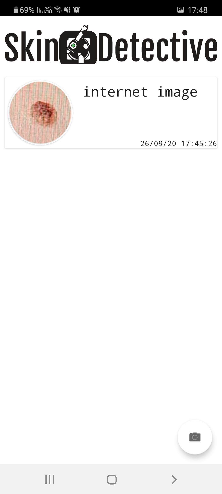
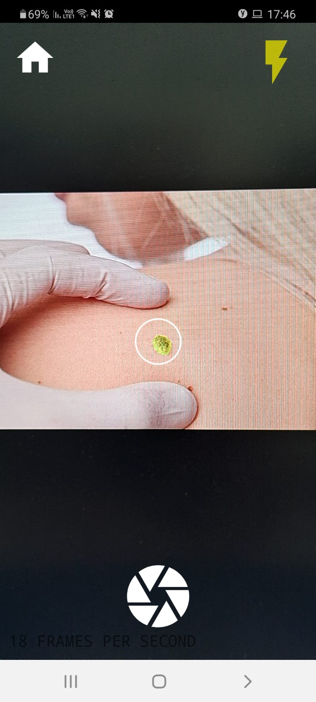
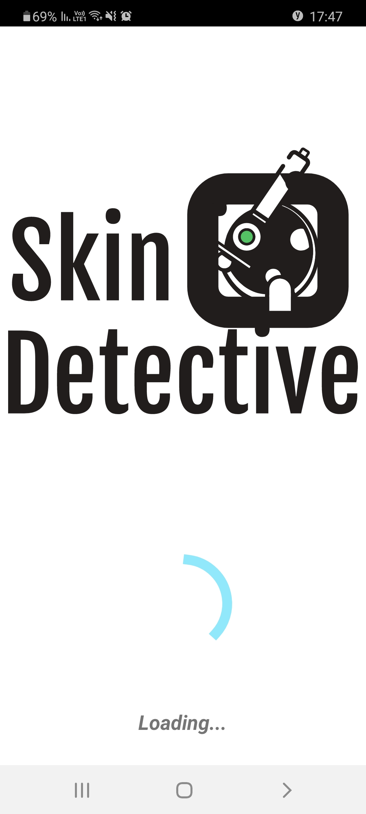
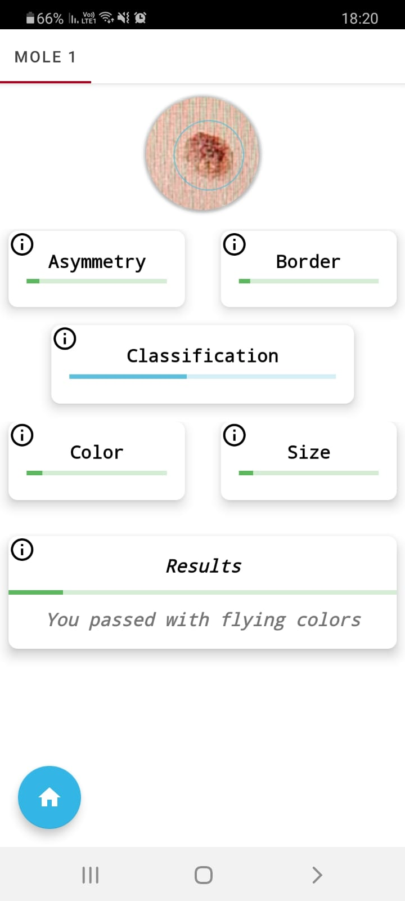

## Skin Detective App

 **The app is aimed to discover dangerous skin lesion(s) such as malignant melanoma.**

### ***Usage:*** 

1. Download the source code from github
1. Start the java application on your device
1. Inside the application you can either:
	1. View previous results
	1. Start a new analysis
	
### ***Activities***

#### ***Home Activity***

#### ***Camera Activity***

#### ***Analyse Results Activity***

#### ***Results Activity***

