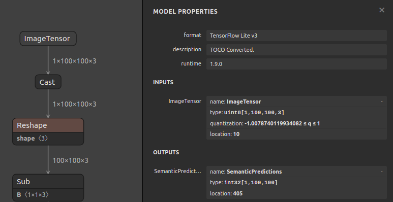

## Skin Detective App

 **The app is aimed to discover dangerous skin lesion(s) such as malignant melanoma.**

### ***Usage:*** 

1. Download the source code from github
1. Start the java application on your device
1. Inside the application you can either:
	1. View previous results:
		1. Press the wanted row in the home activity's history list.
	1. Start a new analysis:
		1. Press the camera FAB (floating action button) located in the bottom of the home activity.
		1. Locate the suspicious mole on your body with the device's camera
		1. Press the botton located in the bottom of the screen to start take short video of the mole.
		1. Once analysis of the suspected mole is done, you'll be directed toward the result screen.
		1. Save the results in the device's history by pressing **SUBMIT RESULTS** or exit the screen by pressing the home button
	
### ***Activities***

| `Home Activity` | `Camera Activity` |
| :---: | :---: |
|  |  |
| `Analyse Results Activity` | `Results Activity` |
|   |  |

### ***Netron preview***

The model is `quantization aware trained` that was converted by `TOCO converter` to `tflite` format

### ***UML class diagrams***

Activity | SVG file | PNG picture |
| :---: | :---: | :---: |
| Home Activity |[home_activity.svg](app/UML/home_activity.svg) | [home_activity.png](app/UML/home_activity.png) |
| Camera Activity |[camera_activity.svg](app/UML/camera_activity.svg) | [camera_activity.png](app/UML/camera_activity.png) |
| Analyse Results Activity |[analyse_results_activity.svg](app/UML/analyse_results_activity.svg) | [analyse_results_activity.png](app/UML/analyse_results_activity.png) |
| Results Activity |[results_activity.svg](app/UML/results_activity.svg) | [results_activity.png](app/UML/results_activity.png) |
| Database |[database.svg](app/UML/database.svg) | [database.png](app/UML/database.png) |